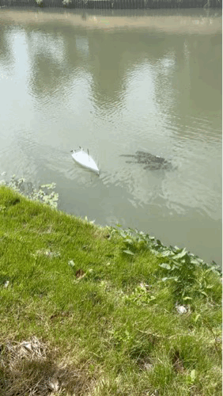

# rc-yacht
本项目致力于自主可控地制造遥控帆船，项目包含两个部分，其一为船体建模和制作（在[cad](./cad)目录中），其二为控制电路的制作与编程（在[control](./control)目录中）。

船体模型需要使用3D打印，并且后续需要用到胶接、喷漆等等步骤，对手工技艺有一定要求，并且需要自备碳纤维杆、碳纤维管、舵机、摇臂、传动钢丝、电池、遥控套件、帆布（风筝布）、鱼线、羊眼钉等等DIY材料。

## 测试

装上帆用风力航行：

卸下帆用电力航行：

