# 遥控帆船（建模部分）

本目录下的代码为帆船的建模代码，使用python3语言，依赖于[solidpython](https://github.com/SolidCode/SolidPython)模块，需要安装：
```
pip install solidpython
```
在正确执行
```
python rc-yacht.py
```
之后，当前工作目录下会生成6个scad文件（scad文件是[openscad](http://openscad.org)软件的源码文件，用openscad打开后，可以看到预览，或者渲染模型、导出stl文件）。这6个scad文件分别是：hull.scad、door.scad、rudder.scad、boom.scad、jib_boom.scad和overview.scad。

## 部件

### hull.scad
生成船壳，船壳带有桅杆安装孔、舵孔、舵机平台、龙骨（稳向板）和铅坠舱，并且甲板后半部分预留了一片较大的开口，即舱门，方便维护。示例如下图：

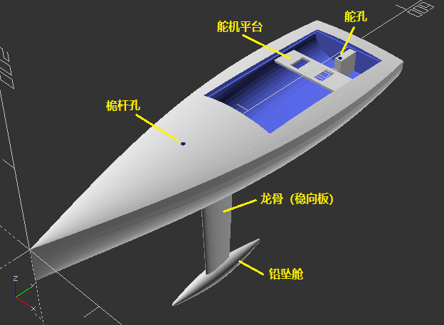

### door.scad
生成舱门盖，可与船壳扣合。注意观察船壳的舱门，四周有一圈突出，可以托住舱门盖。舱门盖上会带有两个“触角”，用来安装气动螺旋桨电机。“触角”中空，可将电机线通入船舱内。另外还有一个帆索孔，用于穿过帆索，控制帆的开角。示例如下图：

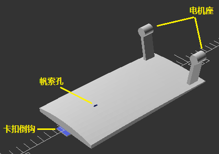
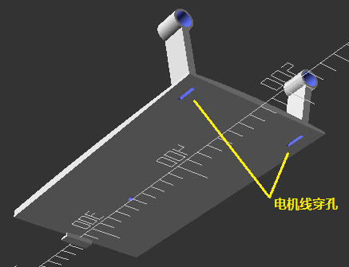

### rudder.scad
生成舵，通过传动轴穿过舵孔进入船舱，与舵机相连。示例如下：

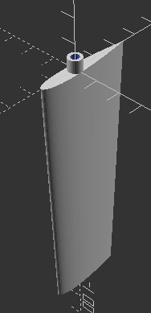

### boom.scad
生成主帆横杆，套在桅杆上实现旋转。示例如下：

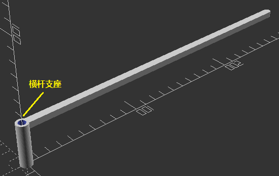

### jib_boom.scad
生成前帆横杆。示例如下：

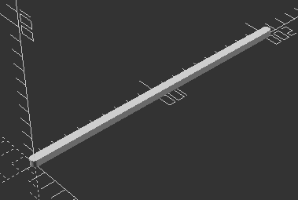

可以看到这是最简单的一个零件了。

### overview.scad
将以上5个部件摆放在一起，用于查看整体效果：

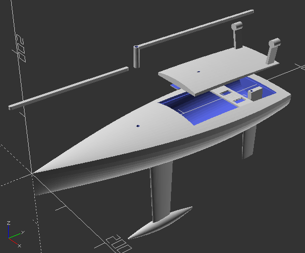

## 组装
主船体的尺寸通常超过打印机的打印尺寸。建议从龙骨中间分割，分段打印，放入铅坠后再粘合。铅坠可以购买钓鱼用的铅坠，有条件的可以自己熔铅制备。舵孔处用碳纤维管穿过，然后再用碳纤维杆做传动轴，连接舵。

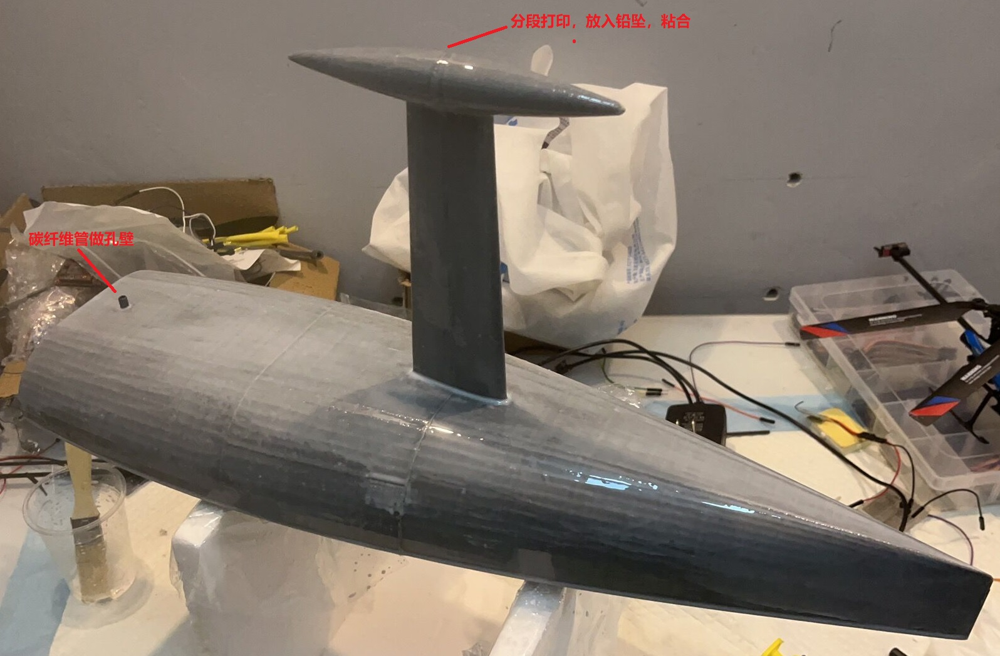

动力部分需要自备电机与螺旋桨（我用了1020空心板和76mm螺旋桨），自备连接舵的传动轴（可以使用碳纤维杆）、舵机、摇臂等。电机线从电机座中间的空心穿过，进入船舱，并建议用胶布固定，避免与帆索缠绕。帆索穿过舱门盖的帆索孔，一端连接舵机。

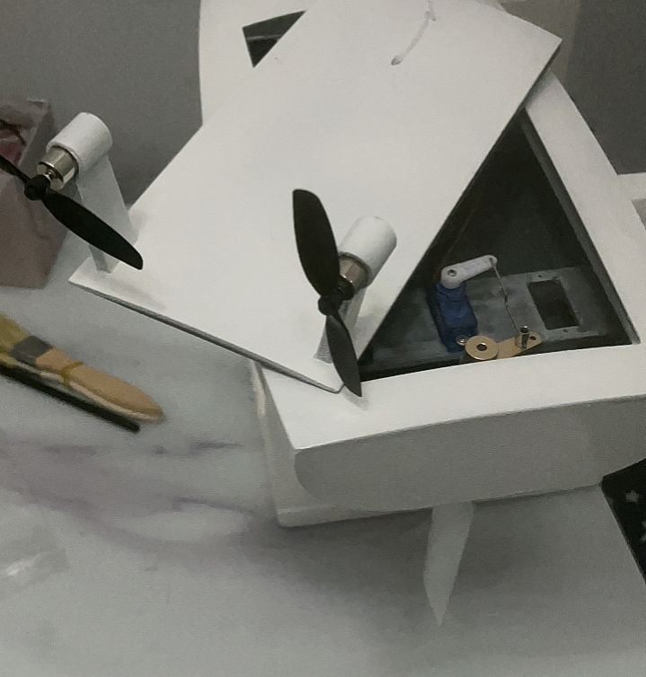
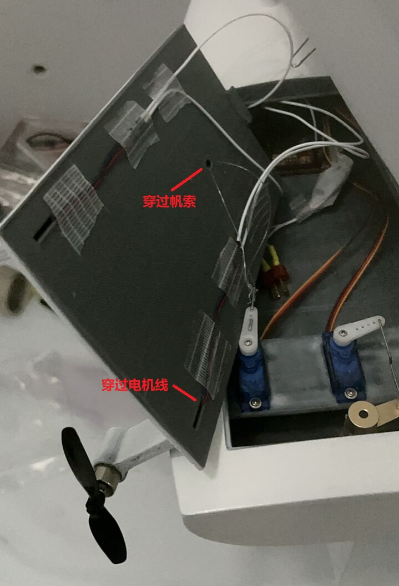

帆的顶端使用鱼线和羊眼钉固定在桅杆（碳纤维杆）顶部。

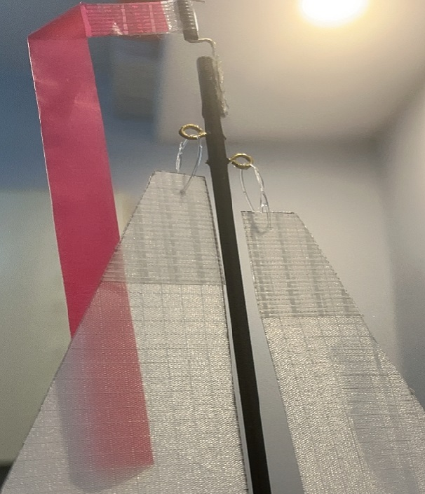

主帆的下部固定在主帆横杆上，主帆横杆套在桅杆上，可自由旋转。主帆索用回形针固定在主帆横杆上。

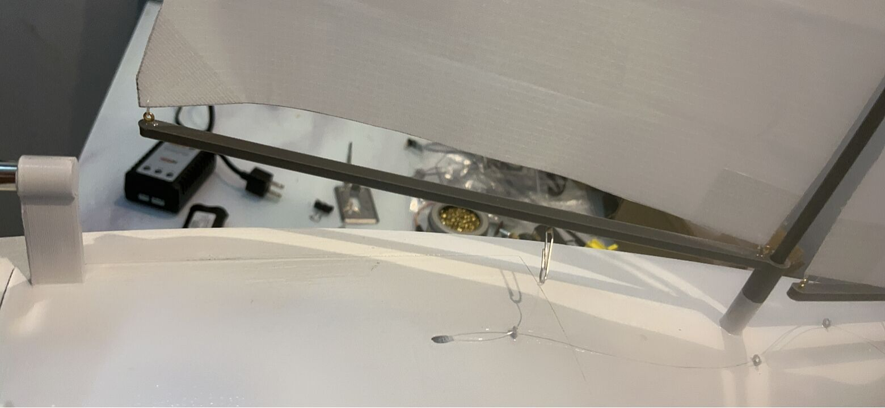

同理，前帆的下部固定在前帆横杆上。前端用回形针牵引到船头，可自由旋转，后端用回形针牵引前帆索。

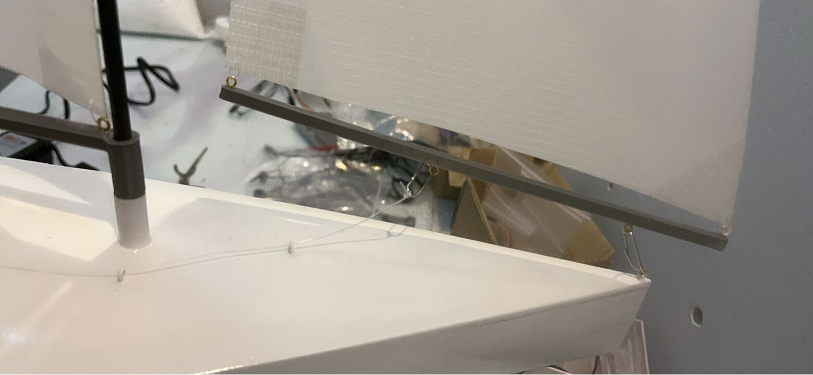

桅杆孔处插入一段不太长的碳纤维管，再插入较长的碳纤维杆，用限位器固定。

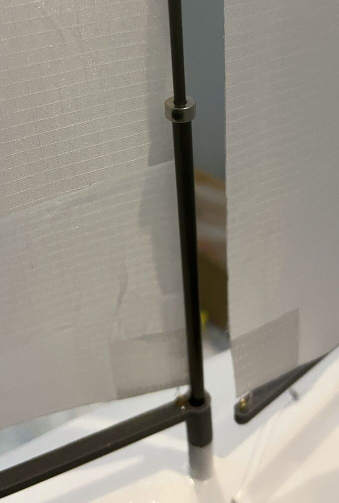

如此，构成了帆的快拆结构。当需要卸下帆时，拧松限位器，将碳纤维杆更深地插入碳纤维杆，帆面失去张力，就可以将横杆从回形针中取出，然后抽出碳纤维杆，连带着帆一起收纳。当需要安装帆时，将碳纤维杆深深地插入碳纤维杆，将主帆横杆套入桅杆，并连接到主帆索的回形针中，将前帆横杆前端绕入船头的回形针，后端连接前帆索的回形针，然后向上抽出碳纤维杆，直到帆面张紧，然后拧紧限位器。
